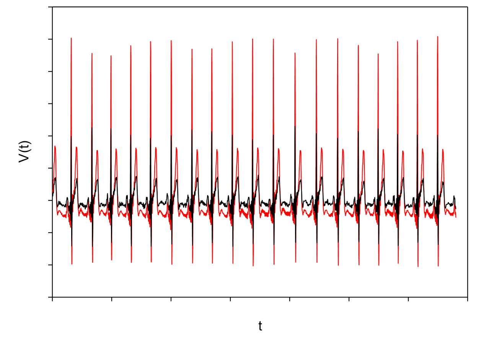

## *English translation*:

# ECG signal pattern detection
#### *Using statistics indicators and correlation techniques*

This is seminar work for school assignment

## Assignment

#### Data info:
In folder EKG you'll find 10 ECG signals (including files ecg_01.txt to ecg_10.txt) where each file contains two filled columns of data (two measurements of ECG signal) 
and in file mujSignal.txt (mySignal.txt) contains only one measurement.

#### How to:
**Using correleation, covariation and other statistics indicators (of your choice)**, try to find resemblence between signals of ecg_*.txt files and mujSignal.txt. 

Present the resemblence using graphs, covariation matrix, correlation functions and etc. During analysis don't forget to remove artefacts which can hinder finding the best signal and also, noise, trend and influence of the correlation results.

Lower, you can see in the image an example of two signals. Before analysis they need to be "centralized".

## *Czech translation*

# Detekce vzorů v EKG signálu
#### pomocí statistických ukazatelů a korelačních technik. 

## Zadání

#### Info o datech

Ve složce EKG najdete 10 signálů EKG (viz soubory ecg_01.txt až ecg_10.txt), kde každý soubor obsahuje dva sloupce dat, tedy dvě měření EKG signálu, a soubor mujSignal.txt, který obsahuje pouze jedno měření. 

#### Jak na to:

Pomocí korelace, kovariance a statistických ukazatelů (Vašeho výběru) zjistěte podobnost signálu ze souboru mujSignal.txt s měřeními v souborech ecg_01.txt až ecg_10.txt. Podobnost přehledně prezentujte graficky, pomocí kovarianční matice, korelačních funkcí aj. Při analýze nezapomeňte odstranit ty artefakty, které by Vám mohly zabránit nalézt nejlepší shodu včetně odstranění trendu, šumu a vlivu počátku na výsledky korelace. Níže na obrázku vidíte příklad dvou EKG signálů, které je nutné před analýzou nejprve „centralizovat“.

"Non centralized image":

